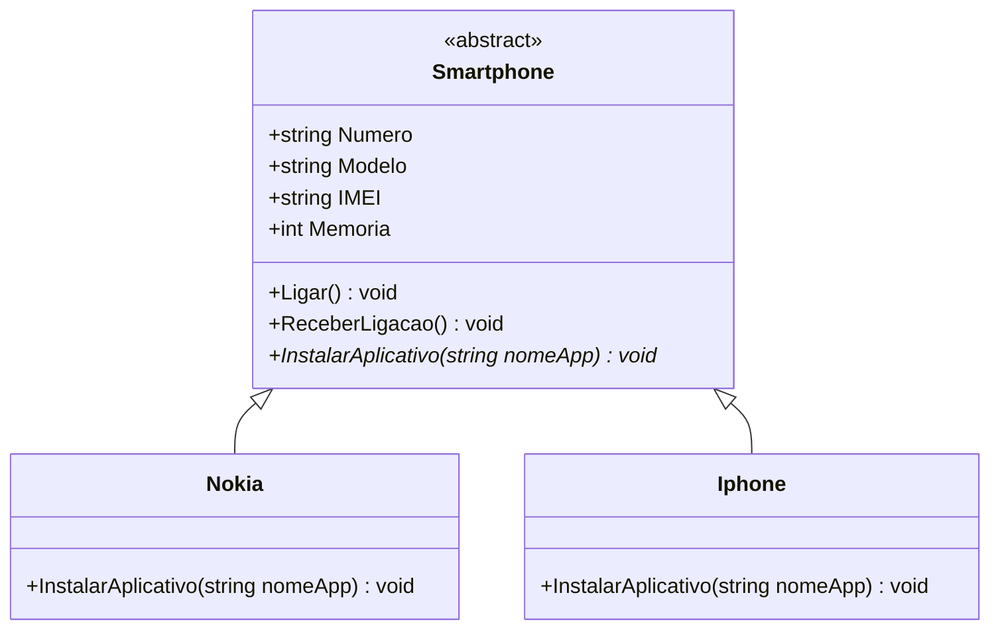

# 📱 Sistema de Abstração de Celular

Projeto desenvolvido como parte da **Trilha .NET - Programação Orientada a Objetos** da [DIO (Digital Innovation One)](https://www.dio.me).

---

## 📋 Sobre o Projeto

Este projeto modela um sistema de celulares utilizando os pilares da **Programação Orientada a Objetos (POO)** em C#. A proposta central é demonstrar o uso de **classes abstratas**, **herança** e **polimorfismo** para representar diferentes modelos de smartphones com comportamentos específicos por marca.

---

## 🎯 Conceitos Aplicados

| Conceito POO       | Onde foi aplicado                                                      |
|--------------------|------------------------------------------------------------------------|
| **Abstração**      | Classe `Smartphone` abstrata define o contrato comum entre os celulares |
| **Herança**        | `Nokia` e `Iphone` herdam de `Smartphone`                              |
| **Polimorfismo**   | `InstalarAplicativo` é sobrescrito em cada subclasse                   |
| **Encapsulamento** | Propriedades como `Numero`, `Modelo` e `IMEI` protegidas na classe base |

---

## 🗂️ Estrutura do Projeto

```
SistemaAbstrairCelular/
│
├── Models/
│   ├── Smartphone.cs      # Classe abstrata base
│   ├── Nokia.cs           # Implementação para Nokia
│   └── Iphone.cs          # Implementação para iPhone
│
├── Program.cs             # Ponto de entrada da aplicação
├── DesafioPOO.csproj
└── DesafioPOO.sln
```

---

## 🧩 Diagrama de Classes



---

## ⚙️ Regras de Negócio

- A classe `Smartphone` é **abstrata**: não pode ser instanciada diretamente, servindo apenas como modelo base.
- As classes `Nokia` e `Iphone` são **filhas de Smartphone** e herdam seus comportamentos comuns.
- O método `InstalarAplicativo` é **sobrescrito** em cada subclasse, pois Nokia e iPhone possuem formas distintas de instalar aplicativos:
  - **Nokia** instala via loja própria da Nokia.
  - **iPhone** instala via App Store da Apple.

---

## ▶️ Como Executar

### Pré-requisitos

- [.NET SDK](https://dotnet.microsoft.com/download) (versão 6.0 ou superior)
- Git

### Passo a passo

```bash
# Clone o repositório
git clone https://github.com/TerencioFonseca/SistemaAbstrairCelular.git

# Acesse a pasta do projeto
cd SistemaAbstrairCelular

# Execute o projeto
dotnet run
```

---

## 💡 Exemplo de Saída

```
Ligando para o número: 1234-5678
Recebendo ligação...
Instalando o aplicativo Spotify através da Loja Nokia.
Instalando o aplicativo Spotify através da App Store.
```

---

## 🛠️ Tecnologias Utilizadas

- **C#** — Linguagem principal
- **.NET** — Plataforma de desenvolvimento
- **POO** — Paradigma de programação orientado a objetos

---

## 📚 Referências

- [Trilha .NET DIO](https://www.dio.me)
- [Documentação oficial C# - Classes Abstratas](https://learn.microsoft.com/pt-br/dotnet/csharp/programming-guide/classes-and-structs/abstract-and-sealed-classes-and-class-members)
- [Repositório original do desafio](https://github.com/digitalinnovationone/trilha-net-poo-desafio)

---

## 👨‍💻 Autor

Feito com 💙 por **Terencio Fonseca**

[](https://github.com/TerencioFonseca)
